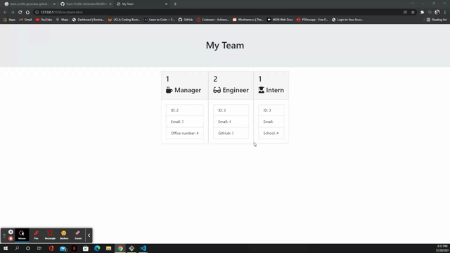

# Team-Profile-Generator
# Description
 *The Team Profile Generator is a node command line interface that allows a manager to input information about each team member of their team. This will create a HTML webpage that will display a summary of each team member to easily access their team's contact information.*

# Installation
*Copy the clone link of the repository from GitHub.*
- Open Bash or Terminal Window.
- When the console opens, navigate to the directory the repository will be added to. 

# Use the command cd to change directories.
- In the console, type the command git clone and paste the link to repository.
- Open repository in preferred code editor.
- Open terminal in code editor.
- Type in terminal npm i or npm install to install dependency packages needed.

# The Result:

*With the help of everyone and my tutor, using application of concepts, and making specific changes to the files, I was able to ensure an accesible, efficient, and easy way to build my Team-profile-Generator.*

# Website:

# Test

# Usage
- The user will navigate to index.js file in terminal.
- The user will type node index.js to initiate the team manager's prompt questions. The user will answer each question. Then, will be asked to add a team member.
- Once the user has added all members desired and selected 'Done' as their option. The user's input will be added to specific sections of the HTML.
- The HTML file will be stored in a folder. When user opens the HTML file, it will display a nicely formatted team roster with contact information based on their input.

# Sources:

- HTML and CSS

- Semantic HTML

- Web accessibility standards

- Markdown and Visual Studio Code

- Make a README

- Interactive tutorial

# License Copyright (c) 2012-2021 Scott Chacon and others

Permission is hereby granted, free of charge, to any person obtaining a copy of this software and associated documentation files (the "Software"), to deal in the Software without restriction, including without limitation the rights to use, copy, modify, merge, publish, distribute, sublicense, and/or sell copies of the Software, and to permit persons to whom the Software is furnished to do so, subject to the following conditions:

The above copyright notice and this permission notice shall be included in all copies or substantial portions of the Software.

THE SOFTWARE IS PROVIDED "AS IS", WITHOUT WARRANTY OF ANY KIND, EXPRESS OR IMPLIED, INCLUDING BUT NOT LIMITED TO THE WARRANTIES OF MERCHANTABILITY, FITNESS FOR A PARTICULAR PURPOSE AND NONINFRINGEMENT. IN NO EVENT SHALL THE AUTHORS OR COPYRIGHT HOLDERS BE LIABLE FOR ANY CLAIM, DAMAGES OR OTHER LIABILITY, WHETHER IN AN ACTION OF CONTRACT, TORT OR OTHERWISE, ARISING FROM, OUT OF OR IN CONNECTION WITH THE SOFTWARE OR THE USE OR OTHER DEALINGS IN THE SOFTWARE.
